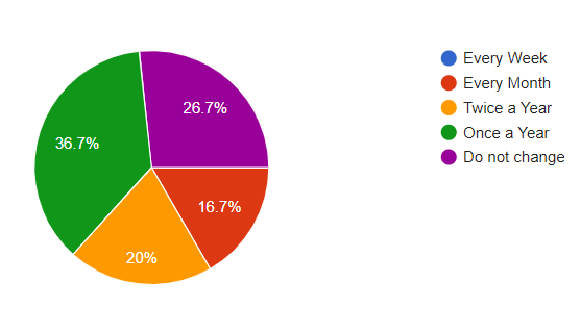
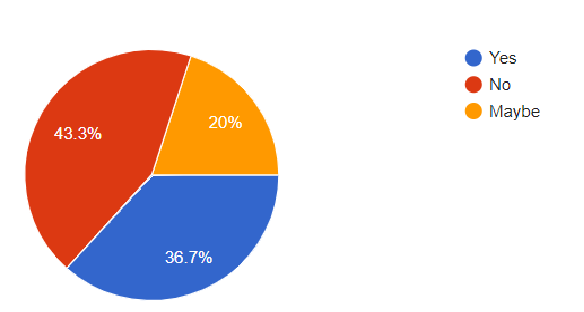
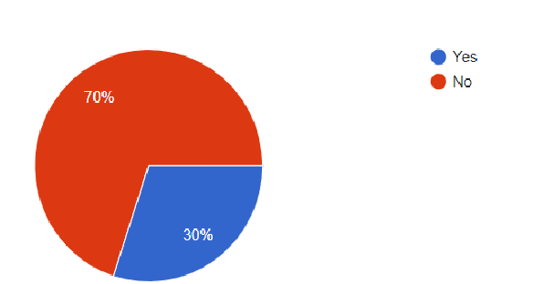

# Cybersecurity Awareness and Education for Enhanced Online Safety in University Settings

### Authors:
- **Zubair Ahmed**  
- **Muhammad Fahad**  
- **Muzamil**  
- **Amanullah**  

## Abstract

This research paper examines the state of cybersecurity in higher education, focusing on the knowledge and awareness of cybersecurity among college and university students and faculty, the effectiveness of security measures implemented by educational institutions, and the need for improved cybersecurity awareness programs.

Through a comprehensive existing literature and survey data analysis, the paper identifies areas of improvement in current security measures and provides recommendations for enhancing cybersecurity awareness on campuses. The findings emphasize the importance of promoting password security practices, raising awareness about the risks of public Wi-Fi, encouraging regular antivirus software updates, discouraging the sharing of login credentials, and enhancing cybersecurity communication and awareness initiatives within educational institutions.

By addressing these areas, universities can contribute to creating a more secure digital environment for their students and faculty.

## Introduction

As technology continues to advance, the threat of cyber-attacks has become increasingly prevalent in all areas of society, including education. Educational institutions are particularly vulnerable due to the high volume of sensitive data stored on their networks. Cybersecurity breaches can lead to significant losses, including financial, reputational, and legal implications. Therefore, it is crucial to assess the security measures taken by colleges and universities to protect their students and employees from such attacks.

This paper aims to review the existing literature and survey data on cybersecurity in higher education, and investigate the following:

- The level of knowledge of cybersecurity among college and university students and faculty
- The effectiveness of security measures currently implemented by educational institutions
- The need for improved cybersecurity awareness programs in colleges and universities

Through this research, we hope to provide valuable insights into the perceptions of college and university students and faculty towards cybersecurity, identify areas of improvement in current security measures, and recommend strategies for better security awareness on campuses. 

## Literature Review

### Theoretical Background:

The literature review emphasizes the importance of cybersecurity awareness programs to reduce the frequency and success rate of cyber-attacks in educational institutions. According to the review, there is a direct relationship between preventive measures and information security awareness. The more aware individuals are of basic principles of cybersecurity, the less frequent cyber-attacks are successful.

Additionally, knowledge of information security has a significant impact on the behavior of people. Developing effective cybersecurity awareness programs, training, education, policies, and simulation tools can help improve the security of educational institutions.

### Empirical Background:

Educational institutions are among the most vulnerable to attacks. Cybercriminals often target educational institutions to steal valuable data such as patent awards and information on students and staff. Research shows that university students are particularly vulnerable due to limited knowledge of cybersecurity.

For example, a survey of college students in Tamil Nadu, India, indicated that only 70% of students were aware of basic virus attacks and antivirus software, while more than 97% did not know the source of the virus. Similar studies conducted in Malaysia and other regions have shown that students lack knowledge about cybersecurity threats.

Simulation tools and games have been shown to improve cybersecurity awareness. Games like CyberCIEGE have been used to improve cybersecurity awareness, and early results show they can be effective.

## Problem Statement

The problem addressed in this research is to understand the perception of students in higher education regarding the cybersecurity measures taken by their IT departments. The study aims to investigate students' awareness, satisfaction, and confidence in the existing cybersecurity measures and identify areas for improvement. By examining students' perceptions, this research seeks to guide future efforts to enhance online security for students in university settings.

## Methodology

This research employed a mixed-methods approach, combining a literature review and a survey to gather and analyze data on cybersecurity in higher education. The survey consisted of multiple-choice and open-ended questions covering topics such as cybersecurity knowledge, experiences with cyber-attacks, password security practices, public Wi-Fi usage, antivirus software updates, sharing of login credentials, perceptions of cybersecurity resources, and participation in awareness programs.

The survey was administered electronically to a sample of 30 college and university students from various disciplines. Data analysis utilized appropriate statistical methods, including descriptive statistics and inferential analysis.

## Findings and Discussion

The data collected provides insights into the perception of students regarding the cybersecurity measures taken by their educational institution's IT department. The majority of respondents (82.1%) indicated they have not been victims of cyber-attacks while using the network of their educational institution.

Key findings:
- 35.7% of students update their passwords once a year, while 25% do not change their passwords at all.
- 50% of students feel the institution provides adequate resources and support for cybersecurity.
- 67.9% of students have used public Wi-Fi to access online resources.
- 32.1% of students do not update their antivirus software regularly.
- 39.3% of students have shared login credentials with others.

Only 25% of students reported receiving communication about cybersecurity threats, and 71.4% have not participated in any cybersecurity awareness programs.

## Conclusion

While most students have not experienced cyber-attacks, several areas need improvement, including password security practices, awareness about public Wi-Fi risks, and antivirus updates. Enhancing cybersecurity communication and awareness initiatives can help create a more secure digital environment.

## Recommendations

- **In-depth analysis of security measures**: Evaluate the effectiveness of specific security measures such as firewalls, intrusion detection systems, and encryption protocols.
- **Long-term assessment of awareness programs**: Conduct longitudinal studies to assess the effectiveness and sustainability of cybersecurity awareness programs.
- **Exploration of emerging threats**: Research emerging threats like ransomware, IoT vulnerabilities, and the role of artificial intelligence in detecting cyber-attacks.
- **Assessment of faculty and staff**: Investigate the role of faculty and staff in promoting cybersecurity awareness.

## Appendix

### Questionnaire for Cybersecurity Awareness and Education

1. Have you ever been a victim of a cyber-attack while using the network of the educational institution?
2. How often do you change your passwords for online accounts associated with the educational institution?
3. Do you think the educational institution provides adequate resources and support for cybersecurity?
4. Have you ever used public Wi-Fi to access online resources related to the educational institution?
5. How often do you update your antivirus software on personal devices used for educational purposes?
6. Have you ever shared your login credentials for online resources related to the educational institution with anyone else?
7. Have you ever received any communication from the educational institution about a cybersecurity threat?
8. Have you ever participated in any cybersecurity awareness programs provided by the educational institution?
9. Have you ever participated in any cybersecurity training sessions provided by the educational institution?

### Figures

- **Password Change Frequency**  
  

- **Password Sharing Frequency**  
  

- **Participation in Cybersecurity Awareness Programs**  
  

## References

1. Cyber Security Awareness Among University Students: A Case Study 2020.
2. Cybersecurity Awareness and Training (CAT) Framework for Remote Working Employees 2022.
3. A Study on Cybersecurity Awareness Among Students in Yobe State University, Nigeria: A Quantitative Approach 2020.
4. The UKM Students Perception towards Cyber Security 2019.
5. Envisioning a Cyber-Security Incident Managed Campus Environment 2020.
6. Applicable Cyber Security Recommendations to Prevent Cyber Attacks in Universities 2022.
7. A Comparative Study of Cyber Security Awareness, Competence and Behavior 2022.
8. A Study on Student Cyber Safety Consciousness in the Light of Online Learning 2022.
9. The Use of Public Cloud Services Among Students for Online Learning 2022.
10. Information Protection of International Students Based on Network Security 2021.
11. Boosting Students and Teachers Cybersecurity Awareness During COVID-19 Pandemic 2021.